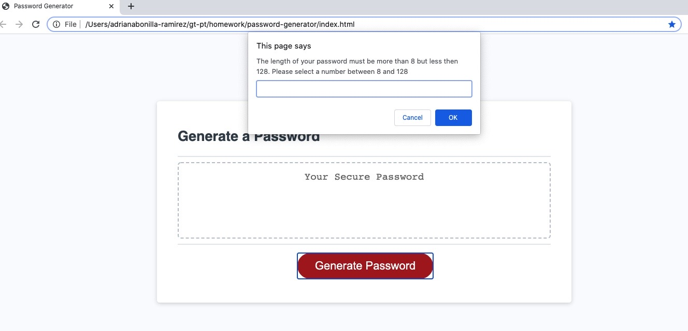
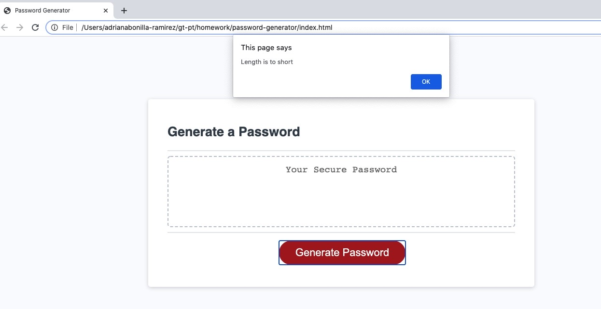
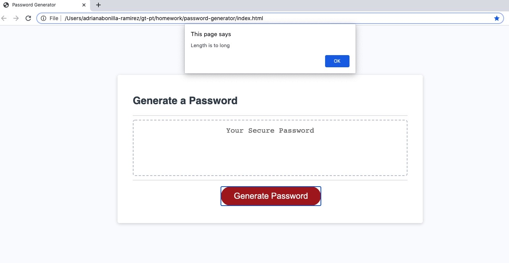
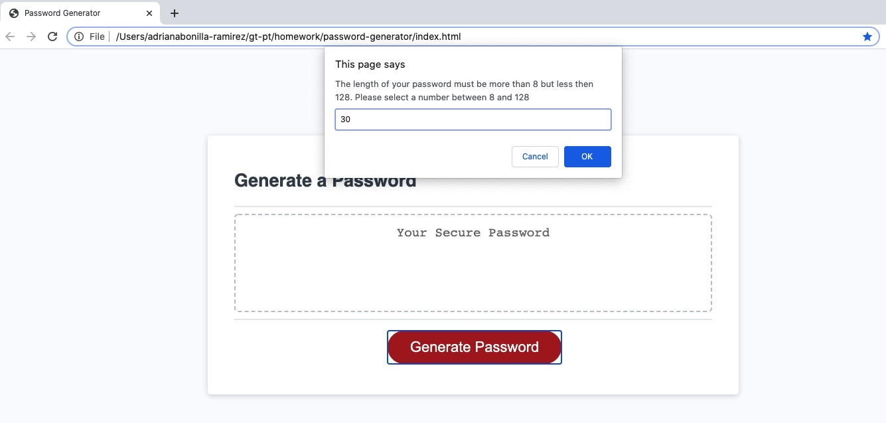
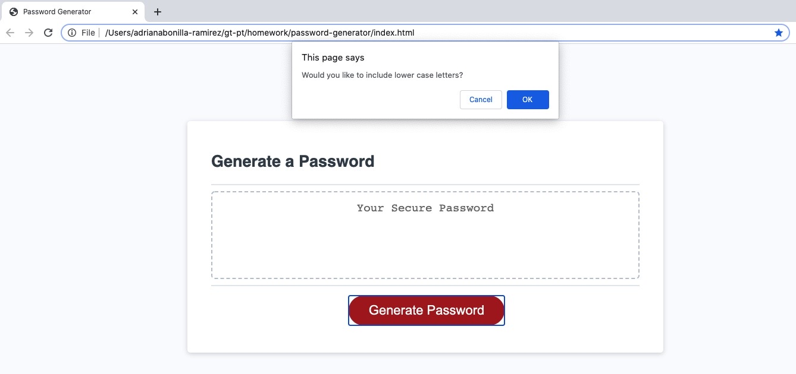
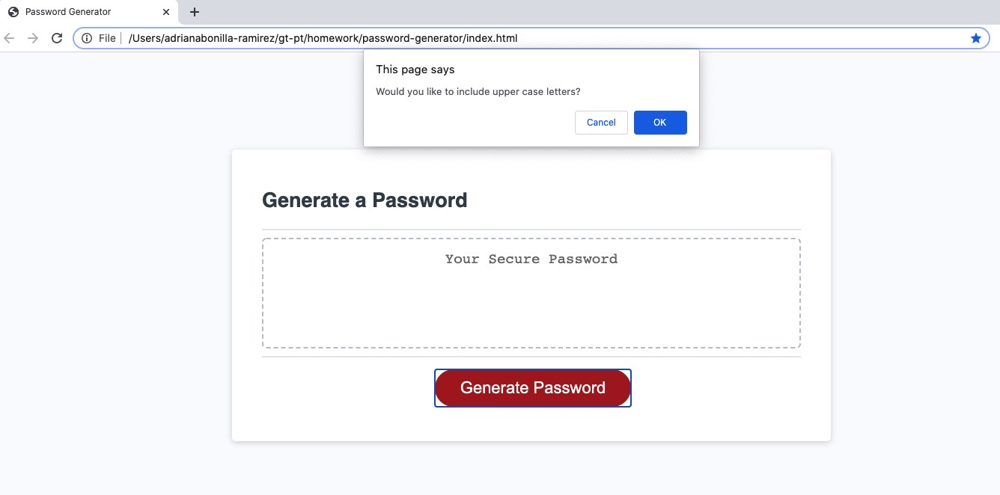
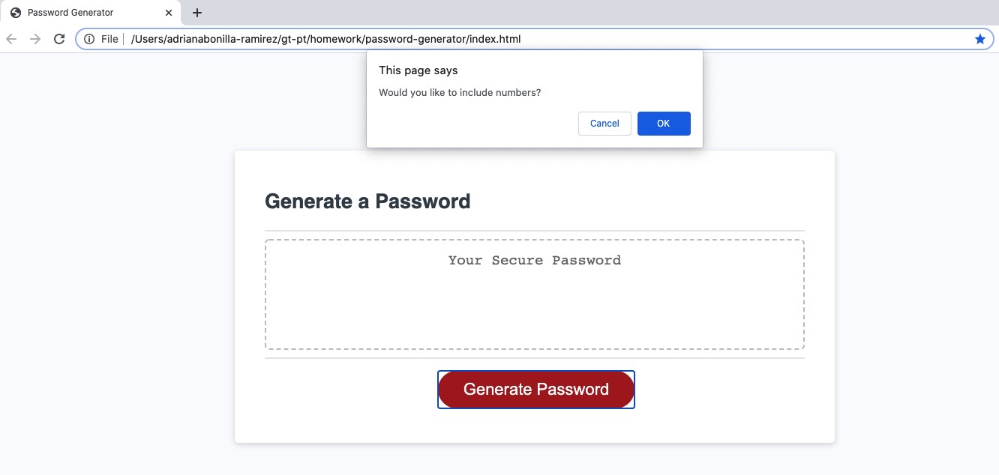
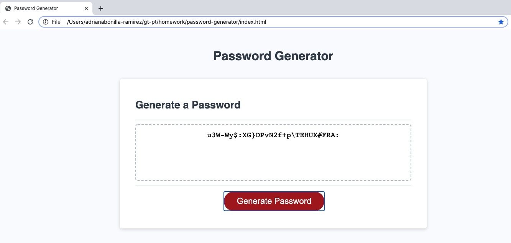

# password-generator

## OBJECTIVE

The goal of this project is to create an application that helps the user to generate a strong password based on the criteria selected.

The password can include upper and lower case, as well as numbers and symbols

When the user clicks the generate password button, the user is asked a series of questions to define the length of the password, and the characters to included in the password (Upper case, lower case, number or symbols)

Development Phase - 
- Define the arrays of upper case, lower case, numbers, and symbols
- Define the prompts that will capture information from the user in terms of password length and characters
- Define conditions and exceptions
- Define method to generate unique password
- Define for loop
- write and unit test

Testing Phase
- Test for negative cases - password length is too long or too short
- Test for combination of characters

Deployment Phase
- Git push
- Run application in github

## This is how it works - 

1. User is prompted for length

2. If length doesn't meet the specified criteria the user gets a too short or too long message

3. User enters length that meets criteria

4. User is asked if they want to include lower case

4. User is asked if they want to include upper case

4. User is asked if they want to include numbers

4. User is asked if they want to include symbols

5. Password is generated

Visit the application here - https://adrianalbr.github.io/password-generator/

2020 Adriana Bonilla-Ramirez All Rights Reserved.
